# OneColumnEncoder

一款基于 .NET 9/WPF 的次时代智能视频编码辅助工具。主要流程围绕“导入工具和编码器、导入视频或脚本源、分析源视频、定制编码命令、自定义并行策略、编码监控、中断与封装”展开。

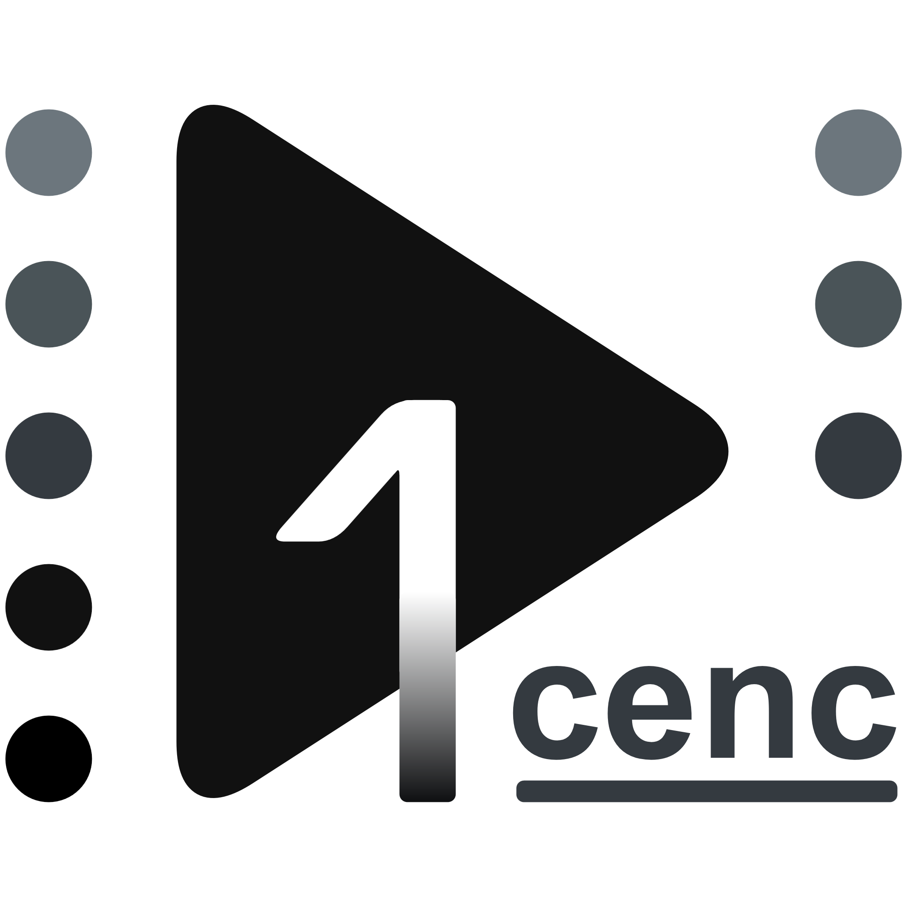

## 功能概述

**验证源与环境**
- 根据 ffprobe 读数验证源视频
- 检查当前的环境与配置是否正确
- 提供包含成功、警告和错误状态的源检查清单与强行绕过功能

**高级并行处理**
- 在指定线程数量的基础上，支持逐物理核心和 NUMA 节点绑定设置

**编码器压制参数配置**
- 提供方便的 UI 控件来配置视频压制参数
- 提供单图压制 A/B 对比预览器

**视频滤镜配置**
- 提供 FFMPEG-VS-AVS 滤镜编辑器
- 自动编写基本的 AviSynth、VapourSynth 脚本（解码→Y4M）
- 为 FFMPEG-VS-AVS 生成多种滤镜：
  - VFR→CFR
  - HDR→SDR（WCG）
  - 色彩空间转换
  - SAR 修复
  - 缩放
- 为 VapourSynth 提供额外的 OpenCL 滤镜：
  - 降噪
  - 去色带
  - 高斯模糊
- 提供单图 VapourSynth A/B 对比预览器

**可控自动化**
- 自动生成视频压制参数，并生成音频压制命令
- 支持高级压制模式：
  - **队列模式**：一次进行一系列视频源的滤镜处理和压制
  - **拼接模式/合并模式**: 一次进行多个视频源的拼接、滤镜处理和压制
  - **重分集模式**: 一次进行多个视频源的虚拟重组与再切割，以修正合并盘与肉酱盘，或误切分的视频源

在合并模式里，如果选择 AAC 或 Opus 这类音频重编码，会把音频单独拆成一条 ffmpeg 压制命令，再接一条最终封装命令，命令列表会变成“视频压制 -> 音频压制 -> 封装”。

**可编辑蓝光章节导入**
- 直接导入 BDMV 结构下的 PLAYLIST 列表，解析并自定义蓝光章节选取

**取段打样**
- 基于 FFMPEG-VS-AVS 命令行实现的片段截取压制
- 提供方便截取时间或帧号段的操作界面

**压制监控系统**
- 监控压制进程的内存使用详情
- 拆分查看上游和下游（编码器）日志
- 选择性地中断上游和下游（编码器）进程

**覆写保护**
- 基于待覆盖文件大小的冷却时间防呆设计

## 软件截图

本软件支持多语言，但为减少图片数量而在此统一用了英语文本截图。图片中可能会有一些过时的 UI 元素或文本，但整体布局和功能区域划分仍然适用。请以实际使用版本为准。

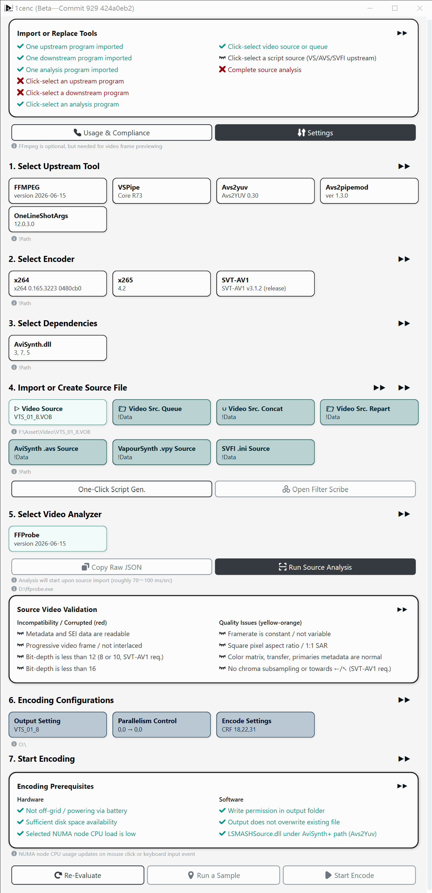 
<i>主页</i> 
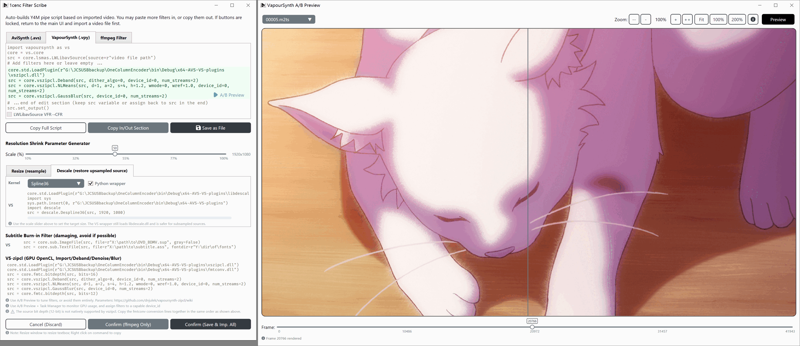 
<i>滤镜编辑器</i> 
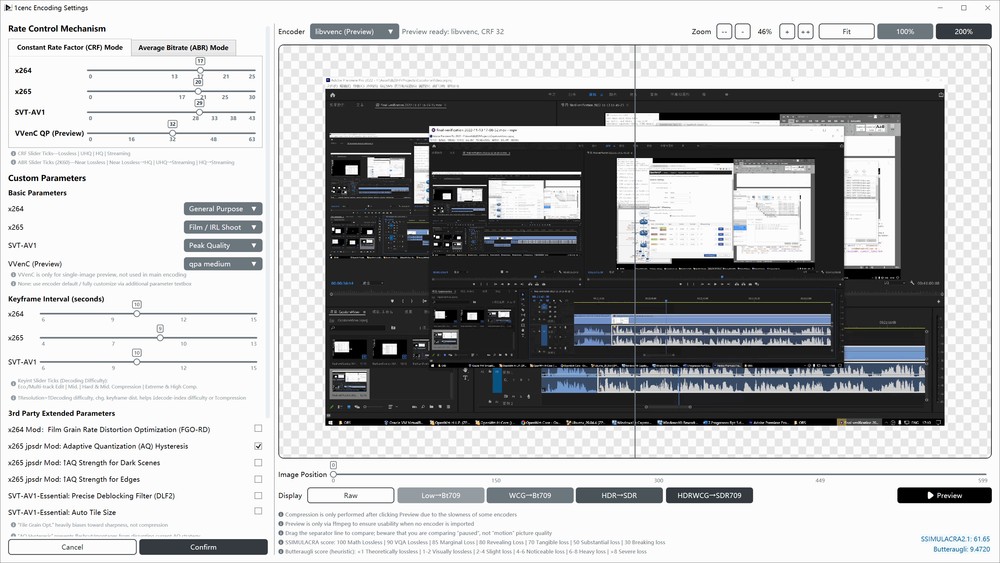 
<i>编码器/压制设置</i> 
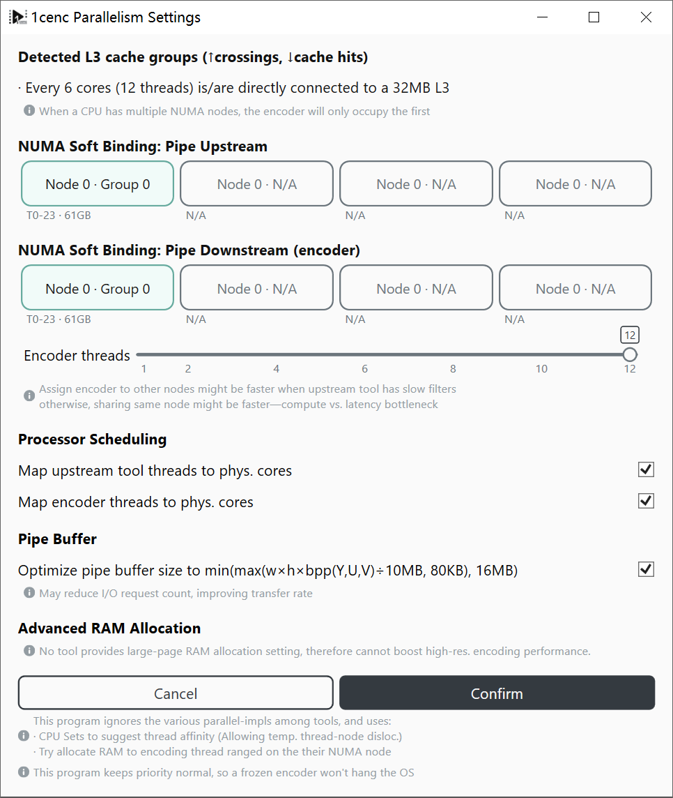 
<i>并行计算设置</i> 
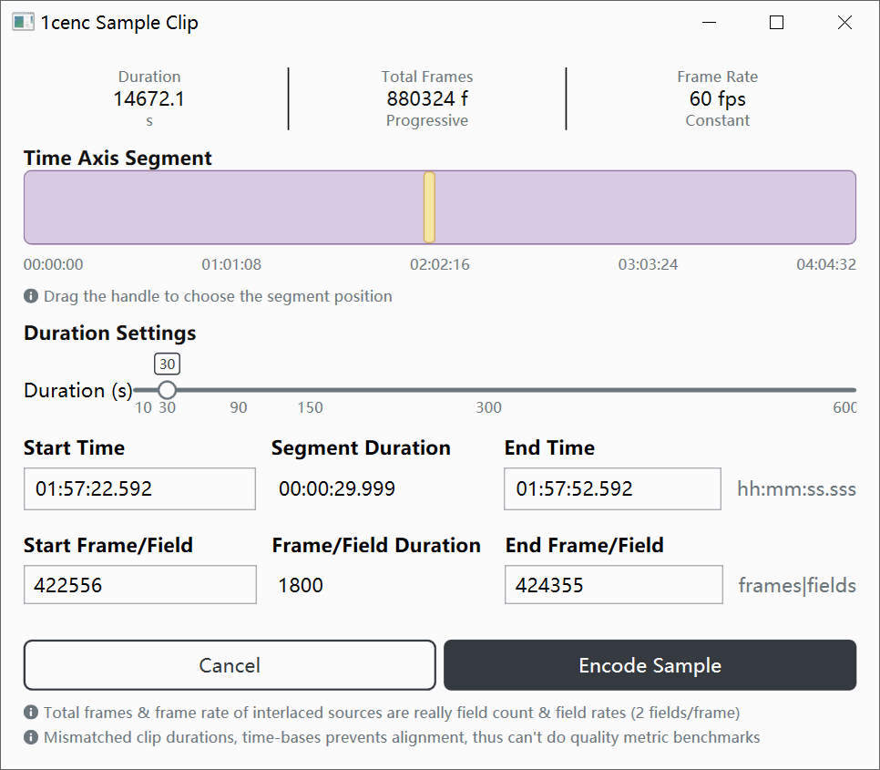 
<i>取段打样器</i> 
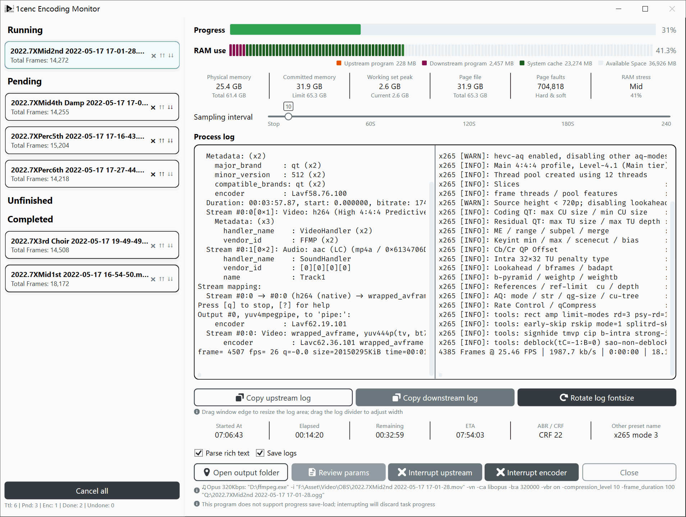 
<i>压制监视器</i> 
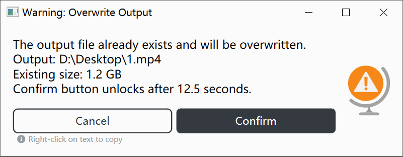 
<i>报错窗口与覆写保护功能</i> 
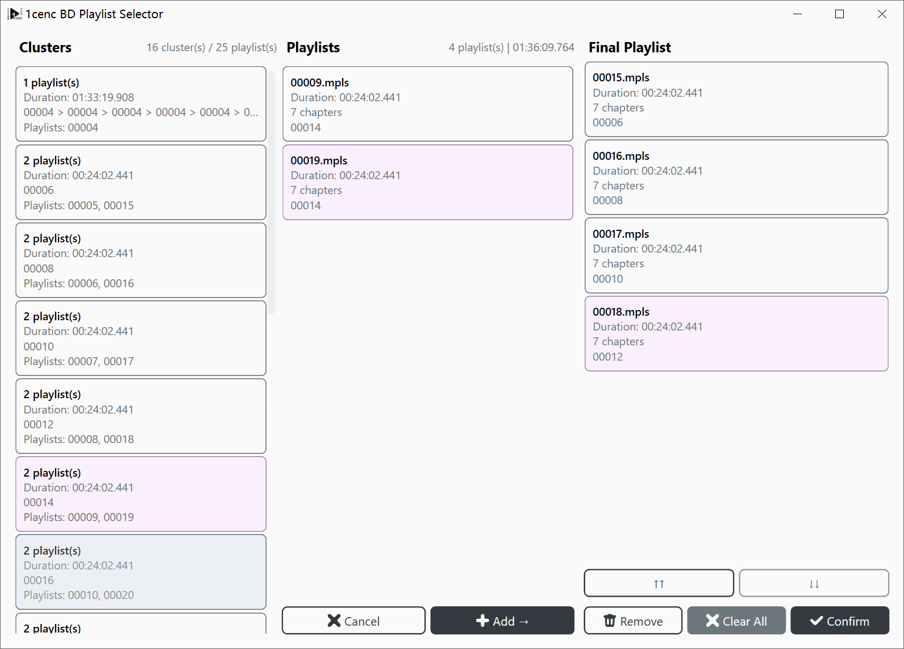 
<i>蓝光播放列表选择器</i> 
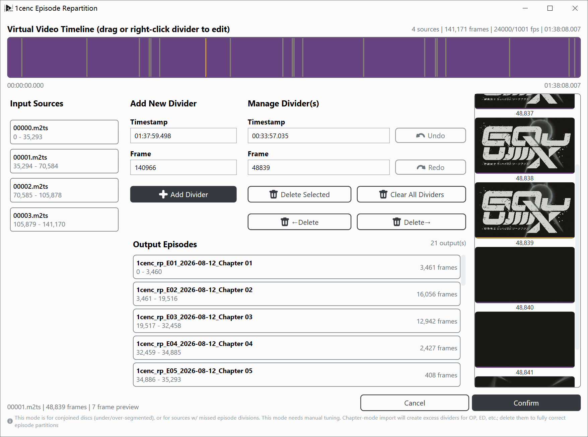 
<i>重分集编辑器</i> 
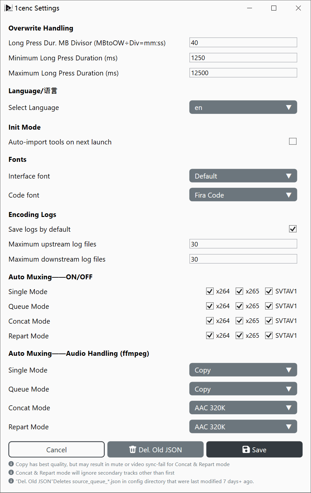 
<i>程序设置</i> 
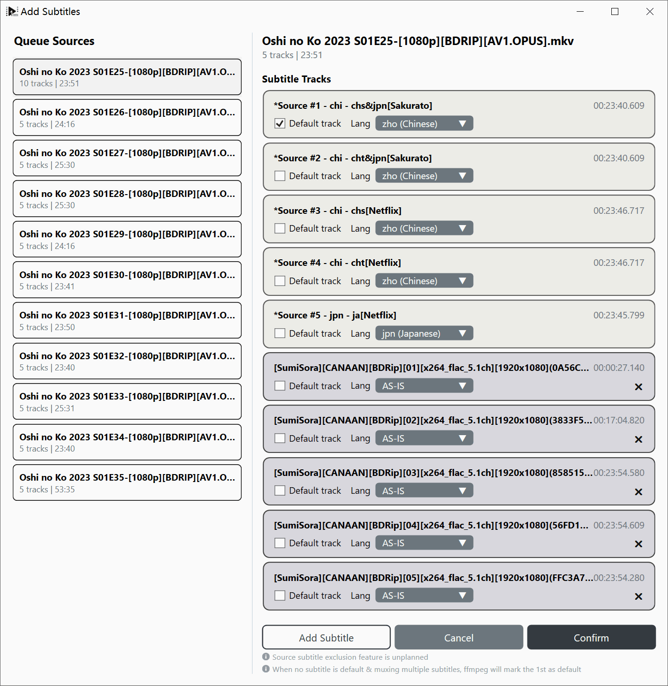 
<i>字幕轨道编辑器（队列模式）</i> 

## 运行要求

- Windows 10/11 x64
  - 推荐 1809 / 21H2（LTSC）或更高版本，最低 1607

### 下载软件本体

- [GitHub 发布页](https://github.com/iAvoe/OneColumnEncoder/releases)

### 下载编码相关工具

你可以根据此教程来寻得合适的工具：
- [Encoding Tools Download Tutorial](https://github.com/iAvoe/encoding-tools-download-tutorial)

若需急用之，也可直接下载并直接使用附带的工具（不推荐但可以）

**支持的管道上游程序（解码与滤镜工具）**
- ffmpeg
- vspipe（支持 API 3.0、4.0 自动识别）
- avs2yuv
- avs2pipemod
- SVFI

**支持的管道下游程序（编码器）**
- x264 core 165 或更新
- x265 v4.2 或更新
- SVT-AV1 v4.1 或更新

> 使用最新版本的编码器有助于提高性能（速度、画质、压缩率），以及更小的内存泄露概率

## 图标使用

- Azure icons: [azureicons.com](https://www.azureicons.com)
- 单色小图标 by NiewBie: [GitHub/Niewbie](https://github.com/Nieobie/Game-Icon-Pack)

## NuGet 包使用

- 蓝光播放列表解析器 by [tautcony](https://github.com/tautcony): [ChapterTool Core](https://github.com/tautcony/ChapterTool/pkgs/nuget/ChapterTool.Core)

---

## 验证状态

**已验证 OS**
- Windows 10 22H2
- Windows 11 25H2（感谢 [Lofu](https://github.com/Ronifue) 帮助）

**已验证 CPU**
- Core i5 7600k（4C4T）
- Ryzen 9 9900X（2CCD 12C24T）
- EPYC 7R13（6CCD 48C96T）
- Intel i7 14700K（感谢 Whithost 帮助）

> 包括 L3 缓存大小与 CCD 分组辨识能力的检测

**长队列任务**
- 圆满完成了 30+ 4K 视频的长队列压制的测试（3 天无人值守）

---

## 打赏信息

开发这些工具并不容易。如果这套工具提高了你的效率，那么不妨赞助或推广一下。

 
 
 

## 项目状态

### 已完成

#### 应用框架与主界面

- WPF 应用启动、主窗口和主界面布局已经实现，入口在 `App.xaml.cs`、`MainWindow.xaml`、`Views/MainUI.xaml`
- `MainVM` 负责主界面模块编排，包括工具区、源导入区、分析区、检查卡、编码设置区和启动区
- 模态窗口导航、遮罩状态、关闭命令和基础命令模型已经实现
- 多语言切换机制已经接入主要界面、卡片、按钮和模态窗文本

#### 工具导入与选择

- 支持导入、替换、删除和选择外部工具
- 已定义并支持的上游工具包括 `ffmpeg.exe`、`vspipe.exe`、`avs2yuv.exe`、`avs2pipemod.exe`、`one_line_shot_args.exe`
- 已定义并支持的编码器包括 `x264.exe`、`x265.exe`、`svtav1encapp.exe`
- 已定义并支持的分析和依赖项包括 `ffprobe.exe`、`avisynth.dll`
- 工具版本检测、文件名校验、工具分区、默认选择和依赖/来源兼容性刷新已经实现

#### 源导入与脚本生成

- 支持导入普通视频源、AviSynth 脚本、VapourSynth 脚本和 SVFI ini 源
- 支持源文件路径持久化，并在启动时回填仍存在的源文件
- 一键生成 AviSynth / VapourSynth 脚本已经实现，会写出 `.avs` 和 `.vpy` 文件并回填到脚本源卡片
- 源类型与上游工具之间的选择联动已经实现
  - 例如 `vspipe.exe` 对应 `.vpy`，`avs2yuv.exe` / `avs2pipemod.exe` 对应 `.avs`

#### ffprobe 源分析与源检查

- `ffprobe` JSON 分析已经实现，并可复制原始分析结果
- 源检查卡已经解析并展示 progressive、位深、帧率、SAR、色彩元数据、chroma、HDR / Dolby Vision 源信息等检查项
- 源检查问题查看、检查清单状态刷新和手动绕过已经接入主流程

#### 编码前置检查

- 编码前置检查卡已经实现硬件和软件检查项
- 已包含 AC 电源、输出目录、磁盘空间、写权限、输出文件覆盖、AviSynth / L-SMASH 相关检查
- 编码前置问题查看、重新评估和手动绕过已经接入启动按钮状态

#### 编码参数配置

- x264 / x265 / SVT-AV1 的 CRF / ABR 基础参数配置已经实现
- 编码预设、关键帧间隔和部分第三方参数开关已经实现并持久化
- 编码设置卡片会显示当前编码参数摘要
- 编码管线会根据当前配置生成对应编码器参数
- ffprobe 自动参数现在也会在元数据存在时补充 HDR mastering display 与 content light level；源检查副标题会直接显示 HDR / Dolby Vision 源信息

#### 编码命令生成与启动

- Y4M 管线命令生成已经实现，支持多种上游工具输出到 x264 / x265 / SVT-AV1
- 命令生成会结合 ffprobe 信息生成色彩、range、chroma、lookahead、HDR mastering display、content light level 等参数；帧数只有在原始元数据里本来就可靠时才会使用
- 启动编码前会弹出命令确认窗口，确认后进入编码监控窗口

#### 采样片段

- 支持按时间或帧号选择片段，并支持时间与帧号转换
- 采样片段会以 sample 模式打开编码监控流程
- SVFI / OneLineShotArgs 当前不支持采样片段，主界面已有禁用提示

#### 编码监控与进程执行

- 支持启动上游进程和编码器进程，并将上游 stdout 管道传给编码器 stdin
- 支持读取上游程序与下游程序（编码器）stderr、日志折叠、保存日志、查看编码命令和调整日志字号
- 在总帧数可靠时支持编码进度、已写帧数、当前/预计输出大小、耗时、剩余时间和完成时间估算
- 支持内存占用、工作集峰值、Page Fault、内存压力和内存范围条统计
- 支持中断上游或编码器进程，编码完成后才能关闭窗口

#### 并行基础能力

- NUMA 节点枚举、CPU 拓扑读取、CPU Sets 分配和编码器线程数限制已有实现
- 并行设置可以保存并应用到编码监控启动的上游程序与下游程序（编码器）进程
- 编码器线程数会传给 x264 / x265 参数，SVT-AV1 当前没有线程参数生成

#### 多开（Run multiple instances）

- 单个 1cenc 实例里，下游编码器线程一次只能绑定到一个 NUMA 节点；如果压制任务数量较多，而机器还有空余 NUMA 节点，可以启动与可用 NUMA 节点数量相同的程序实例，并让每个实例各自处理队列中的一部分任务，从而把所有节点都用满。
- 区分这些实例很简单，只要看标题栏或任务栏里的 `1cenc · PID xxxxx · vX.Y.Z` 即可。PID 是进程的临时编号，在运行期间唯一，不同实例不会重复。

#### 应用配置与持久化

- 应用配置、工具路径、源路径、编码参数和并行参数的 JSON 保存/加载基础逻辑已经实现
- 语言配置已经接入保存和加载

#### 输出文件名工具

- 支持路径预览、剪贴板、非法字符、保留名和长度检查
- 确认后会回填输出设置卡片

#### UI 组件

- 卡片、按钮组、下拉菜单、设置项容器、检查清单、整数滑块、片段范围选择器、内存范围条和列文本组件已有实现
- 当前使用到的单向 UI 转换器已经满足现有绑定需求

#### 编码参数配置细节

- `EncoderConfM.CustomParams` 会被保存，且已经被 `EncodingPipeline` 拼入最终编码命令
- "自定义参数"区域不再是第三方开关汇总，而是直接读写一个自由文本参数实现
- x264 / x265 / SVT-AV1 的参数覆盖范围仍有限，但已堪用

#### 脚本编辑器

- 脚本编辑器窗口、AVS / VPY 编辑区、复制完整脚本和复制输入输出片段
- "另存为文件"已实现
- "确认"已实现脚本保存和回填
  - 为简化逻辑，实现和一键生成按钮一样会同时保存 AVS 和 VPY 脚本

#### 主界面 Best Practices 检查卡

- `BestPracsSelfCheckCardVM` 是自查参考卡，不参与编码启动前的阻塞条件
- 无 `RunAllChecks()`、无 `IsBypassed`、无 Inspect/Bypass 按钮
- 通过 `Subtitle` 属性在 UI 上明确标识为仅供参考

#### 应用设置 → 文件覆盖

文件覆盖设置会在展示压制命令并确认后，如果输出文件已存在，则追加覆盖确认弹窗，并按被覆盖文件大小延迟启用确认按钮

#### 队列模式

已实现并验证，确认可用

#### 合并模式

已实现并验证，确认可用

#### 脚本编辑器扩展

已实现并验证，确认可用

#### 重分集模式

已实现并验证，确认可用

#### 字幕轨道编辑器

- 源附带字幕轨道会在封装编辑器中保留 ffprobe 提取的语言和时长元数据
- 导入的字幕文件会被校验，其最后一个字幕片段的结束时间会作为轨道时长
- 源附带的字幕轨道和导入的字幕文件有分色显示功能
- 已测试：调整源附带字幕“默认”的命令行生成效果正常
- 已测试：源附带字幕的元数据解析全部正常
- 已测试：ISO 639-2 语言代码识别正常
- 已测试：队列模式
- 已测试：合并模式

---

### 未验证

### 完全没做

---

### 死胡同

#### P-Core / E-Core 优化

由于需要修改上游程序和编码器源码，该功能无法实现
- UI 中 P-Core / E-Core 相关复选框处于禁用状态
- 这本质上属于 CISC 与 RISC 处理器厂商的职责，不是用户或应用层应该做的事情

#### Large Pages 实现

由于需要修改上游程序和编码器源码，该功能无法实现

#### 自动生成关键帧 qpfile

由于行为过于复杂且耗时，实现失败
- 必须使用比视频编码器自带方法更好的转场检测功能
- 比视频编码器更好的转场检测功能更慢，会大幅增加整体压制耗时
- 最终预期的压缩率和画质提升平均只有（不经过该功能压制结果的）5%

---

### 主要源码位置

- `Commands/`：用户操作命令、模态窗打开关闭、保存加载和编码启动入口
- `Pipeline/`：编码命令行构建、帧数和混流
- `FFmpeg/`：ffprobe 分析和 FFmpeg 进程/参数辅助
- `ToolManagement/`：工具注册、版本检测和兼容性规则
- `ScriptGeneration/`：AVS/VPY 脚本模板
- `CPU/` / `Hardware/`：CPU / NUMA 拓扑、线程集和 OpenCL 检测
- `Persistence/`：JSON 保存/加载基类
- `FileManagement/`：源路径路由、文件选择器和输出路径辅助
- `Models/`：配置模型、工具定义、语言资源、检查清单和数据 DTO
- `ViewModels/`：主界面、模态窗和卡片状态管理
- `Views/`：WPF 窗口和界面 XAML
- `Components/`：复用 UI 控件
- `Converters/`：WPF 绑定转换器

#### 测试与工程化

- 当前没有单元测试、集成测试或自动化 UI 测试项目
  - 许多方案还未完全支持 .Net 9.0 的项目
- README 中尚未包含构建、运行、依赖工具准备和典型工作流说明（不过已在用法说明窗口 / AppUsageModal 中提供）

---

## 确认窗口（ConfirmationModal）出现位置

- 启动编码前的命令确认，以及输出文件覆盖确认：`Commands/StartEncCmd.cs`
- 采样片段启动前的命令确认：`ViewModels/SampleClipVM.cs`
- 编码监控里的“查看编码命令”：`ViewModels/EncodingMonitorVM.cs`
- 脚本生成后的复制/保存结果提示：`ViewModels/ScriptScribeVM.cs`、`Commands/SaveLoad/OneClickScriptGenCmd.cs`
- 源分析和检查结果提示：`Commands/AnalyzeSrcVideoCmd.cs`、`Commands/CopyRawAnalysisCmd.cs`、`Commands/InspectEncProblemsCmd.cs`、`Commands/InspectSrcProblemsCmd.cs`
- 工具导入/文件选择时的二次确认：`Commands/ImportToolCmd.cs`、`FileManagement/SrcFilePicker.cs`

## 设置数据存储位置

所有持久化配置数据以 **JSON 文件** 形式存储在 `{应用程序基目录}\1cenc\` 下：

| 文件 | 内容 |
|------|------|
| `appconfig.json` | 应用设置（覆盖保护配置、语言选择） |
| `appdata.json` | 工具路径/版本/大小、源视频路径、输出目录 |
| `encodingconfig.json` | 编码器参数（CRF/ABR、关键帧、预设、x264/x265/SVT-AV1 自定义参数） |
| `parallelismconfig.json` | 并行设置（NUMA 节点 ID、CPU 偏好、线程数） |

**持久化基类：**`Persistence\SaveLoadBase.cs` 的配置模型继承自 `SaveLoadBase<T>`，通过 `Save()` / `Load()` 提供 JSON 序列化/反序列化。

**其他持久化数据（用户选择路径，不在 `\1cenc\` 中）：**
- 生成的脚本文件（`.avs` / `.vpy` / `.txt`）经由 `ViewModels\FilterScribeVM.cs` 和 `Commands\SaveLoad\OneClickScriptGenCmd.cs`
- stderr 日志文件（`upstream-stderr.txt`、`downstream-stderr.txt`）保存到输出目录，经由 `ViewModels\EncodingMonitorVM.cs`

---

## 免责声明

### 责任限制

因使用或无法使用本软件所导致的任何直接、间接、附带、特殊或后果性损害（包括但不限于商业利润损失、业务中断、计算机系统损坏、数据丢失及商誉损害），即使已被告知此类损害的可能性，开发者亦不承担任何责任。使用者应自行承担使用本软件的一切风险。

### 关于硬件损坏的说明

视频压制属于长时间持续高负载 CPU 计算任务。在此场景下，包括但不限于以下情况可能对硬件造成损害：
- 散热器安装不当、超频不稳定或电压设置过高，可能导致处理器加速老化、电气短路等硬件故障
- 极端负载可能导致系统无响应、蓝屏死机，进而造成数据损坏或丢失

### 本软件提供的保护措施

1. **x265 压力测试预设**：提供用于验证系统稳定性的 x265 压力测试预设。但该测试的实际负载取决于输入视频的内容复杂度，建议使用与目标压制任务一致的测试视频作为源文件进行验证。
    - 由于该测试的压力可能会比 Prime95 等传统压力测试工具更加暴烈，因此运行该测试本身就存在一定风险，只建议在全程监控温度和系统状态的前提下运行，并且在开始测试前先做好数据备份。
2. **避免进程优先级控制**：本软件不会提高编码任务的进程优先级，以确保在编码器无响应时，操作系统及其他程序仍能正常响应。
3. **文件覆盖保护**：在编码启动前，如果输出文件已存在，会弹出确认窗口并根据被覆盖文件大小延迟启用确认按钮，以避免误操作导致的数据丢失。

### 建议用户采取的保护措施

1. **使用可靠的散热设备**：普通的散热风扇难以承受长时间全速运行的损耗，建议选用品质可靠的方案。
2. **合理配置超频策略**：应以长期高负载稳定运行为目标调整 CPU 与内存的超频参数，而非仅追求短时爆发性能。
3. **使用不间断电源（UPS）**：高负载任务运行时突然断电对硬件极为危险，建议配备 UPS 以争取手动保存并关机的缓冲时间。
4. **注意电脑所处环境的湿度**：高湿度环境容易造成电气短路，尤其在高负载、长时间运行的情况下更需注意。

---

## 为什么不做 Linux 支持 / 为什么用 WPF

本软件对 Windows 专有 API 依赖较深，这些 API 构成了核心功能的基础，因此天然绑定在 Windows 平台上：

1. **WPF 呈现层**：WPF 无官方 Linux 支持
2. **Windows 内核 API（P/Invoke 调用 kernel32.dll）**
   - **CPU Sets**：将编码进程绑定到指定物理核心，避开超线程虚拟核心
   - **NUMA 拓扑**：枚举并指定编码器使用的 NUMA 节点，使用户看到的可视化与编码器所见一致
   - **进程枚举**：编码监控中的子进程追踪
   - **电源状态**：编码前检查是否使用市电供电
   - **内存信息**：获取物理内存总量并按 NUMA 节点比例分配估算
3. **psapi.dll**：编码监控功能的工作集/内存压力统计

这些 API 覆盖了并行调度、硬件检测、进程监控、编码前置检查等关键环节，是跨平台 UI 框架无法替代的。

既然底层已经锁死在 Windows API 上，选择 WPF 是最自然的结果——它提供了原生 Windows 桌面集成（包括防止打开溢出画面窗口的功能）、成熟的 MVVM 数据绑定生态，且无需引入浏览器内核或第三方依赖。跨平台框架解决的是 UI 层的移植问题，但无法解决底层 API 的兼容，反而会增加一层抽象成本和测试负担。

综上所述，最适合其它平台的方案是在该平台上用对应原生技术栈重新实现本项目逻辑。由于已有完整源代码和 Agent 辅助编程工具，同时为了降低门槛，本项目使用了 Apache 2.0 许可条款，因此重新开发的难度已然降低。
