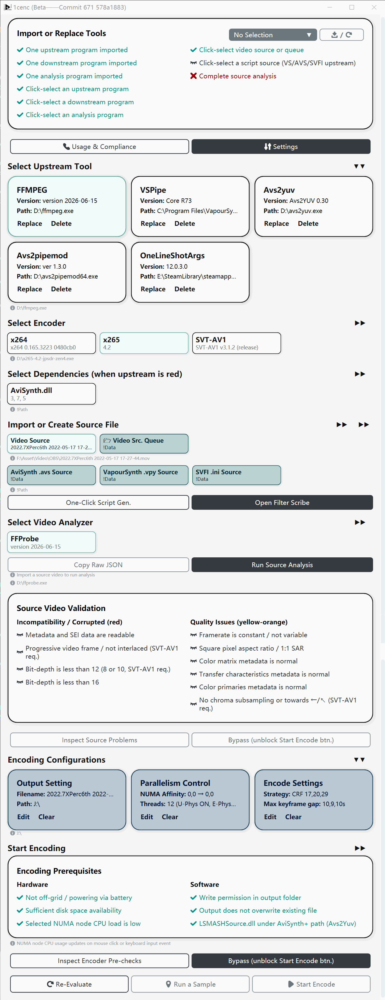
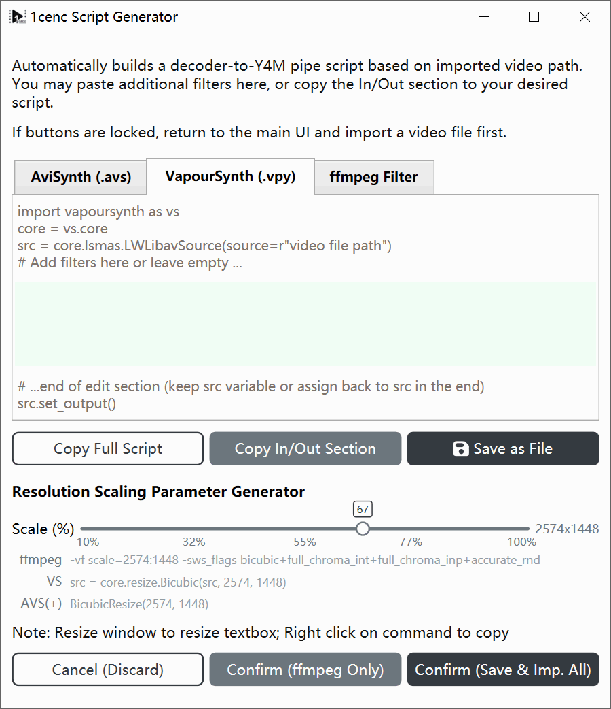
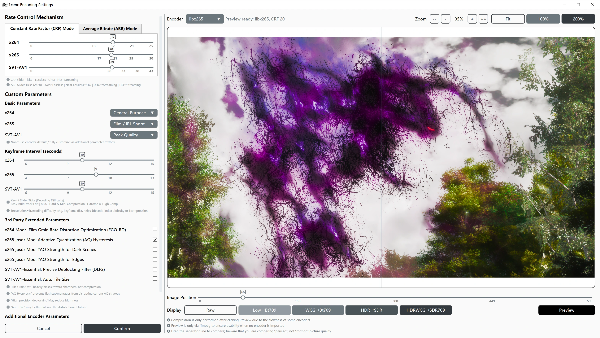
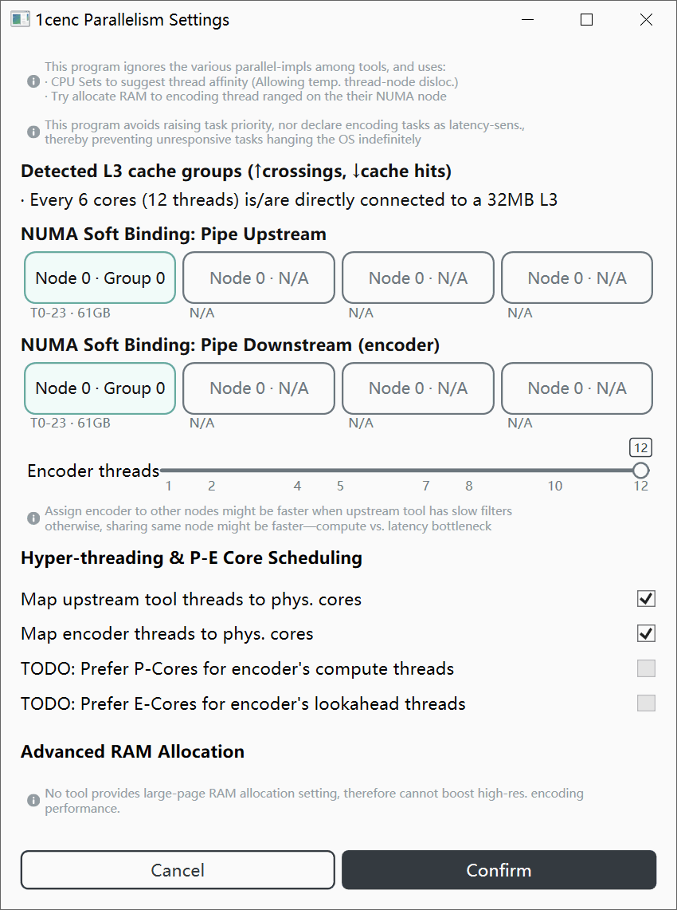
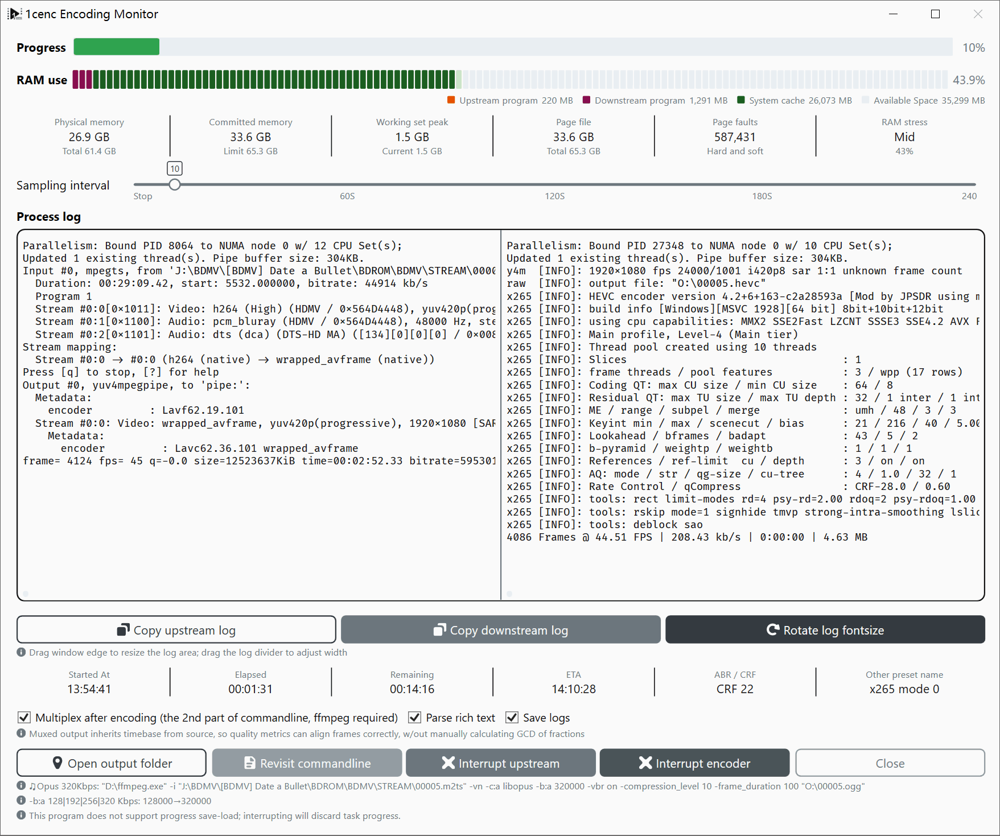

# OneColumnEncoder

A next-gen smart video encoding utility based on .NET 9/WPF, revolves around “tool & encoder orchestrating, source analyzing, encode customizing, parallelism tailoring, modern GUI monitoring, encode interrupting, and auto-multiplexing”.

## Featuring:
- Source Validation:
  - Validate source video from ffprobe readings
  - Providing source checklist with Success, Warning & Error status types
  - Providing bypass feature to continue on error
- Encode Settings:
  - Customize via UI controls including tabs, sliders, dropdown menus, etc.
  - Perform A/B comparison to check impacts as you go
- Advanced Parallelism:
  - Physical Core & NUMA Binding on top of Thread limiting
- Automation & Customization:
  - Auto-generate basic AviSynth & VapourSynth scripts
  - Generate VFR→CFR, HDR→SDR (& WCG) conversion, resize & SAR repair filter for FFMPEG-VS-AVS
  - FFMPEG-VS-AVS parameter/script text editor available
  - Auto-generate video and audio encoding commandlines
  - Providing queued encoding with editable queue
- Clip Sampling: Time/Frame# selection with FFMPEG-VS-AVS commandline generation
- Advanced Monitoring: Monitor RAM usage per-app, separated view of upstream & downstream (encoder) logs
- Interrupt Control: Either interrupt upstream or downstream program (encoder) to consistently exit an encoding session
- Overwrite Protection: Fool-proof Start-Encode cooldown based on file size to be overwritten

## Gallery

This software supports multiple languages, but English text screenshots are used here to reduce the number of images. Some UI elements or text in the images may be outdated, but the overall layout and functional area divisions remain applicable. Please refer to the actual version you are using.

 
 
 
 
 
 
 

## System Requirements

- Windows 10/11 x64
  - Recommended version: 1809/21H2 (LTSC) or higher; minimum: 1607

### Download Encoding Tools

Follow this tutorial to get tool tailored for your use case:
- [Encoding Tools Download Tutorial](https://github.com/iAvoe/encoding-tools-download-tutorial)

Or, TLDR; and use tools provided in this package (not recommended but its an option)
- [Google Drive / ffmepg-ffprobe-x264-x265-SVTAV1 Pkg.](https://drive.google.com/file/d/1DNrVBoJtmYka0LiorjuWDgeGxfnq62PM/view?usp=sharing)

> Minimum requirement is one upstream program + one downstream program

**Supported pipe upstream programs (decoding and filtering tools)**:
- ffmpeg
- vspipe (supports API 3.0 and 4.0 automatic recognition)
- avs2yuv
- avs2pipemod
- SVFI

**Supported pipe downstream programs (encoders)**:
- x264 core 165 or newer
- x265 v4.2 or newer
- SVT-AV1 v4.1 or newer

> Choose only the latest version of encoders to get the best performance (speed, quality, compression), plus less likely to trigger memory leaks

## Icon usage

- Azure icons: [azureicons.com](https://www.azureicons.com)
- Game icon pack by NiewBie: [GitHub/Niewbie](https://github.com/Nieobie/Game-Icon-Pack)

---

## Validation Status

**OS**：
- Windows 10 22H2
- Windows 11 25H2 (thanks to [Lofu](https://github.com/Ronifue))

**Hardware**：
- Core i5 7600k (4C4T)
- Ryzen 9 9900X (2CCD 12C24T)
- EPYC 7R13 (6CCD 48C96T)
- Intel i7 14700K (thanks to Whithost)

**High load**
- Long queue with 30+ 4k videos and x265 encoding was successful

## Localization Status

- **Supported:** English, Simplified Chinese, Traditional Chinese
- **MTL Only:** French, Spanish, Japanese, Russian
- To provide a translation, please fork this repository, add a new language entry in `Models/XxxLangProviderM`, and submit a pull request
  - Translation of the README is not required, but it would be great if you can do that

---

## Support me

Its not esay to develop these tools. If this software helped, please consider sponsoring or promoting it.

 

## Project Status

### Done

#### Application Framework and Main Interface

- App startup, main window, and main interface layout have been implemented, with entry points in `App.xaml.cs`, `MainWindow.xaml`, and `Views/MainUI.xaml`
- `MainVM` is responsible for main interface module orchestration, including the tool area, source import area, analysis area, checklist, coding settings area, and startup area
- Modal window navigation, masking states, close commands, and basic command models have been implemented
- Multi-language switching mechanism has been integrated into the main interface, cards, buttons, and modal window text

#### Tool Import and Selection

- Importing, replacing, deleting, and selecting external tools.
- Defined & supported upstream tools include `ffmpeg.exe`, `vspipe.exe`, `avs2yuv.exe`, `avs2pipemod.exe`, and `one_line_shot_args.exe`
- Defined & supported encoders include `x264.exe`, `x265.exe`, and `svtav1encapp.exe`
- Defined & supported analytics and dependencies include `ffprobe.exe` and `avisynth.dll`
- Tool version detection, filename verification, tool partitioning, default selection, and dependency/source compatibility refresh are implemented

#### Source Import and Script Generation

- Importing regular video sources, AviSynth scripts, VapourSynth scripts, and SVFI ini sources
- Supports persistent source file paths and refilling existing source files upon startup
- One-click generation of AviSynth/VapourSynth scripts is implemented, writing `.avs` and `.vpy` files and refilling them into the script source card
- Linkage between source type and upstream tool selection has been implemented
  - For example, `vspipe.exe` corresponds to `.vpy`, and `avs2yuv.exe` / `avs2pipemod.exe` corresponds to `.avs`

#### ffprobe Source Analysis and Inspection

- JSON analysis of `ffprobe` has been implemented, and the original analysis results can be copied
- The source inspection card has parsed and displayed progressive, bit depth, frame rate, SAR, color metadata, chroma, and other inspection items
- Viewing source inspection issues, refreshing the checklist status, and manually bypassing them have been integrated into the main workflow

#### Pre-coding Inspection

- The pre-coding inspection card has implemented hardware and software inspection items
- Includes checks on AC power, output directory, disk space, write permissions, output file overwrite, and AviSynth / L-SMASH
- Viewing pre-encoding issues, re-evaluating, and manually bypassing them have been integrated into the start button status

#### Encoding Parameter Configuration

- Encoding presets, keyframe intervals, and some third-party parameter switches have been implemented and persisted
- The encoding settings card displays a summary of the current encoding parameters
- The encoding pipeline generates corresponding encoder parameters based on the current configuration

#### Encoding Command Generation and Startup

- Y4M pipeline command generation, supporting output from various upstream tools to x264/x265/SVT-AV1
- Command generation automatically supplements parameters such as frame number, color, range, chroma, and lookahead based on ffprobe information
- A parameter confirmation window pops up before starting encoding; after confirmation, the encoding monitoring window appears

#### Sampling Clips

- Supports selecting clips by time & frame number, and supports timestamp-to-frame-number conversion
- Sampling segments will open the encoding monitoring process in sample mode
- SVFI / OneLineShotArgs currently do not support sampling segments; a disabled message is displayed on the main interface

#### Encoding Monitoring and Process Execution

- Supports starting upstream and encoder processes and passing upstream stdout pipes to encoder stdin
- Supports reading upstream/downstream stderr, log folding, saving logs, viewing encoding commands, and adjusting log fontsize
- Supports encoding progress, number of written frames, current/estimated output size, time elapsed, remaining time, and completion time estimation
- Supports memory usage, working set peak, Page Fault, memory pressure, and memory range statistics
- Supports interrupting upstream or encoder processes; the window can only be closed after encoding is complete

#### Parallelism Basic Capabilities

- NUMA node enumeration, CPU topology reading, CPU Sets allocation, and encoder thread limit are already implemented
- Parallel settings can be saved and applied to the upstream/encoder processes started by encoding monitoring
  - The encoder thread count is passed to the x264/x265 parameter; SVT-AV1 currently does not generate thread parameters

#### Application Configuration and Persistence

- The basic logic for saving/loading JSON for application configuration, tool path, source path, encoding parameters, and parallel parameters has been implemented
- Language configuration has been integrated for saving and loading

#### Output Filename Tool

- Supports path preview, clipboard, illegal characters, reserved names, and length checks
- Output settings cards will be populated upon confirmation

#### UI Components

- Cards, button groups, dropdown menus, settings containers, checklists, integer sliders, fragment range selectors, memory range bars, and column text components have been implemented
- The currently used one-way UI converter meets existing binding requirements

#### Encoding Parameter Configuration Details

- `EncoderConfM.CustomParams` will be saved and appended to the final encoding command by `EncodingPipelineH`
- The "Custom Parameters" area is no longer a summary of third-party switches, but instead directly reads and writes a free text parameter
- The parameter coverage for x264/x265/STV-AV1 is still limited, but it is usable

#### Scriptwriter

- The scriptwriter window, AVS/VPY editing area, copying complete scripts, and copying input/output fragments
- "Save As" is implemented
- "Confirm" has implemented script saving and backfilling
  - To simplify code, it saves both AVS & VPY scripts simultaneously, same as the one-click generate button

#### Main Interface Best Practices Checklist

- `BestPracsSelfCheckCardVM` is a self-check reference card and does not participate in the start-encoding blocking conditions
- No `RunAllChecks()`, no `IsBypassed`, no Inspect/Bypass buttons
- Marked as "Advisory — not blocking" on the UI

#### Application Settings → File Overwrite

The Overwrite setting will append an overwrite confirmation pop-up if the output file already exists after displaying and confirming the compression command, and delay enabling the confirmation button according to the size of the overwritten file

---

### Unverified

#### Queue Mode

- Verify basic and filtered queue suppression on `ffmpeg`, `vspipe`, `avs2yuv`, and `avs2pipemod` queue routes

---

### Not Started

##### None currently

---

### Dead Ends

#### P-Core / E-Core Optimization

This feature cannot be implemented due to the need to modify the upstream program and encoder source code
- P-Core / E-Core related checkboxes in the UI are disabled
- This is really CPU manufacturers' task

### Large Pages Implementation

This feature cannot be implemented due to the need to modify the upstream program and encoder source code

#### Automatic Precise Keyframe Marker (qpfile)

Implementation failed due to excessive complexity and encoding time addition
- A better scene-change detection function than the video encoder's built-in method must be used
- A slower scene-change detection function will significantly increase overall encoding task duration (+50~150%)
- The final expected compression ratio & image quality improvement are only about 5% (compared to compression results without this function).

---

## Main Source Code Locations

- `Commands/`: User operation commands, modal window opening and closing, save loading, and encoding startup entry point
- `Helpers/`: Encoding pipeline, ffprobe analysis, tool detection, script templates, filename validation, CPU/NUMA/permissions, and other auxiliary logic
- `Models/`: Configuration models, tool definitions, language resources, checklists, and data DTOs
- `ViewModels/`: Main interface, modal window, and card state management
- `Views/`: WPF windows and interface XAML
- `Components/`: Reusable UI controls
- `Converters/`: WPF binding converters

### Testing and Engineering

- No unit test, integration test, or automated UI test projects are there
  - Some attempts were declared as not ready due to .Net 9.0 being new
- README has not yet included instructions for building, running, preparing dependencies, and typical workflows (although these are provided in the usage instructions window / AppUsageModal)

---

## Confirm action window (ConfirmationModal) Popup locations

- Confirm encoding commands before starting encode, and file overwriting:`Commands/StartEncCmd.cs`
- Sample clip confirmation before starting encode:`ViewModels/SampleClipVM.cs`
- View encoding commands in the encoding monitor:`ViewModels/EncodingMonitorVM.cs`
- Copy/save results after script generation:`ViewModels/ScriptScribeVM.cs`、`Commands/SaveLoad/OneClickScriptGenCmd.cs`
- Source analysis and check results:`Commands/AnalyzeSrcVideoCmd.cs`、`Commands/CopyRawAnalysisCmd.cs`、`Commands/InspectEncProblemsCmd.cs`、`Commands/InspectSrcProblemsCmd.cs`
- Secondary confirmation when importing tools/selecting files:`Commands/ImportToolCmd.cs`、`Helpers/SourceFilePickerH.cs`

## Settings Storage Location

All persistent configuration data is stored as **JSON files** under `{Application Base Directory}\1cenc\`:

| File | Contents |
|------|----------|
| `appconfig.json` | App settings (overwrite config, language selection) |
| `appdata.json` | Tool paths/versions/sizes, source video paths, output directory |
| `encodingconf.json` | Encoder parameters (CRF/ABR, keyframe, presets, custom params for x264/x265/SVT-AV1) |
| `parallelismconfig.json` | Parallelism settings (NUMA node IDs, CPU preferences, thread count) |

**Persistence base class:** `Helpers\SaveLoadBaseH.cs` — all configuration models inherit from `SaveLoadBaseH<T>` which provides JSON serialization/deserialization via `Save()` / `Load()`.

**Other persisted data (user-selected paths, not in `\1cenc\`):**
- Generated script files (`.avs` / `.vpy` / `.txt`) via `ViewModels\FilterScribeVM.cs` and `Commands\SaveLoad\OneClickScriptGenCmd.cs`
- Stderr log files (`upstream-stderr.txt`, `downstream-stderr.txt`) to the output directory via `ViewModels\EncodingMonitorVM.cs`

---

## Disclaimer

## Limition of Liability

The developer shall not be liable for any direct, indirect, incidental, special, or consequential damages (including, but not limited to, loss of business profits, business interruption, computer system damage, data loss, and damage to goodwill) arising from the use or inability to use this software, even if advised of the possibility of such damages. Users assume all risks associated with the use of this software.

### Risks of Hardware Damage

Video compression is a long-duration, sustained, high-load CPU computing task. Under these conditions, the following factors, among others, may cause hardware damage:

- Improper heatsink installation, unstable overclocking, or excessively high voltage settings may lead to accelerated processor aging, electrical short circuits, or other hardware failures.
- Extreme computational loads may cause system unresponsiveness, blue-screen crashes, resulting in data corruption or loss.

### Protective Measures Provided by This Software

1. **x265 Stress Test Preset**: The software includes an x265 stress test preset for verifying system stability. However, the actual load of this test depends on the content complexity of the input video. Use a test video consistent with the target compression task as the source file for accurate validation.
    - This test can be more brutal & relentless than traditional stress-testing tools like Prime95, running it carries inherent risks. Run this test only while actively monitoring system temperature and status, and save all files before starting the test.
2. **No Process Priority Escalation**: This software does not raise the process priority of encoding tasks. This ensures the operating system and other programs remain responsive even under extreme encoder loads.
3. **File Overwrite Protection**: If an output file already exists before encoding begins, a confirmation window will appear. To prevent accidental data loss, the confirmation button's activation is delayed proportionally to the size of the file being overwritten.

### Recommended Protective Measures for Users

1. **Use Reliable Cooling Equipment**: Standard cooling fans may degrade rapidly under the wear and tear of prolonged, full-speed operation. Ensure the use of quality & heavy-duty cooling.
2. **Configure Stable Overclocking Strategies**: CPU & memory overclocking should be tuned for stable, long-term, high-load operation rather than short-term peak performance.
3. **Use an Uninterruptible Power Supply (UPS)**: Sudden power outages during high-load operations pose severe risks to hardware. A UPS provides critical buffer time to save data and shut down the system.
4. **Monitor Ambient Humidity**: High humidity can lead to electrical short circuits, especially under high-load, long-duration operation. Ensure the computer is in a dry environment.

---

### Why no Linux support / Why use WPF?

This software relies heavily on proprietary Windows APIs, which form the foundation of its core functionality; therefore, it is natively bound to the Windows platform:

1. **WPF Presentation Layer**: WPF has no official Linux support.
2. **Windows Kernel APIs (P/Invoke calls to `kernel32.dll`)**:
   - **CPU Sets**: Binds encoding processes to specific physical cores, avoiding hyper-threaded virtual cores.
   - **NUMA Topology**: Enumerates and specifies the NUMA nodes used by the encoder, ensuring that the visualization presented to the user is consistent with what the encoder sees.
   - **Process Enumeration**: Used for tracking sub-processes during encoding monitoring.
   - **Power State**: Checks whether the system is running on AC power before starting encoding.
   - **Memory Information**: Retrieves total physical memory and estimates allocation based on NUMA node proportions.
3. **`psapi.dll`**: Provides working set and memory pressure statistics for the encoding monitoring feature.

These APIs cover critical areas such as parallel scheduling, hardware detection, process monitoring, and pre-encoding checks—functionalities that cannot be replaced by cross-platform UI frameworks.

Since the backend is already locked to Windows APIs, choosing WPF became the natural decision. It provides native Windows desktop integration (including features to prevent window overflow), a mature MVVM data-binding ecosystem, and requires no browser kernels or third-party dependencies. While cross-platform frameworks solve UI portability, they cannot resolve underlying API incompatibilities; instead, they would only add an extra layer of abstraction cost and testing overhead.

In summary, the best approach for other platforms is to reimplement the project's logic using the corresponding native technology stack of that platform. Because the full source code is available and Agent-assisted programming tools exist—and this project has adopted the Apache 2.0 license to lower the barrier to entry—the difficulty of redevelopment has been significantly reduced.
