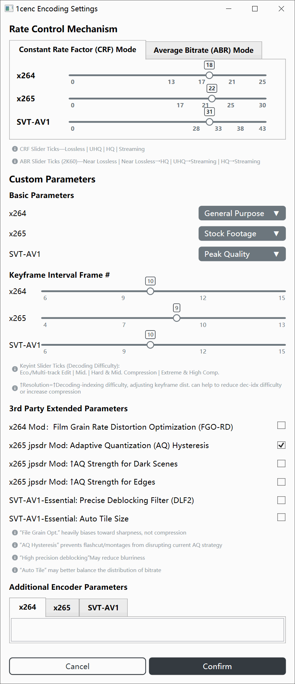
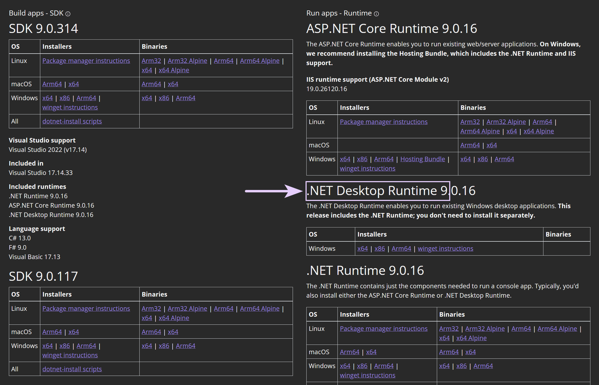

# OneColumnEncoder

[English Version](README-EN.md)

一款基于 .NET 9/WPF 的次时代智能视频编码辅助工具。主要工作流程围绕“导入工具和编码器、导入视频或脚本源、分析源视频、定制编码命令、自定义并行计算策略、现代化编码监控、中断与封装”展开。

目前软件已可正常使用，但部分功能仍缺乏测试，因此暂且以 Beta 版本发布。

## 软件截图

本软件支持多语言，但为减少图片数量而在此统一用了英语文本截图。图片中可能会有一些过时的 UI 元素或文本，但整体布局和功能区域划分仍然适用。请以实际使用版本为准。

1. 主界面：工具区、源导入区、分析区、检查卡、编码设置区和启动区
2. 脚本编辑器：AVS / VPY 编辑区、视频缩放与 VFR 转 CFR 命令生成功能
3. 编码设置：CRF / ABR 参数、自定义预设等配置
4. 并行设置：NUMA 节点、CPU Sets 和高级线程数限制
5. 采样片段：时间/帧号选择、转换和基本预览
6. 编码监控：日志、进度、资源占用、高级中断控制和自动封装控制
7. 警告模态窗和文件覆盖保护功能

 
 
 
 
 
 
 

## 运行要求

- Windows 10/11 x64
  - 推荐 1809 / 21H2（LTSC）或更高版本，最低 1607
- .NET 9 Desktop Runtime
  - 下载地址：[微软官网](https://dotnet.microsoft.com/en-us/download/dotnet/9.0)

**支持的管道上游程序（解码与滤镜工具）**：
- ffmpeg
- vspipe（支持 API 3.0、4.0 自动识别）
- avs2yuv
- avs2pipemod
- SVFI

**支持的管道下游程序（编码器）**：
- x264
- x265
- SVT-AV1

> 最少只需一个上游程序 +一个下游程序

## 图标使用

- Azure icons: [azureicons.com](https://www.azureicons.com)
- 单色小图标 by NiewBie: [GitHub/Niewbie](https://github.com/Nieobie/Game-Icon-Pack)

---

## 验证状态

**系统**：
- 所有测试目前均在 Windows 10 22H2 上验证
- 尚未在 Windows 11 上验证，但应该不会有严重问题...

**硬件**：
- Core i5 7600X（4C4T）
- Ryzen 9 9900X（2CCD 12C24T）
- EPYC 7R13（6CCD 48C96T）
- 缺少英特尔第 12\~14 代及 Ultra 200\~300 系列的异构 CPU 验证

## 本地化状态

- **支持范围**：英语、简体、繁体
- 如需提供翻译，请 fork 此仓库，在 `Models/XxxLangProviderM` 中添加新的语言条目，并提交 pull request。
  - README 的翻译并非强制要求

---

## 打赏信息

开发这些工具并不容易。如果这套工具提高了你的效率，那么不妨赞助或推广一下。

 

## 项目状态

以下内容基于当前代码结构整理实现状态，用于标记主要模块和细分模块的完成度。分类含义如下：

- 完成：已有实际实现，并已接入主流程或当前 UI
- 未验证：已有完整实现，但因环境或外部服务限制尚未经过实际测试
- 未完成：已有 UI、模型或部分逻辑，但行为不完整，或部分配置尚未被实际消费
- 完全没做：仅有占位、清单、字段或旧代码，当前没有实际功能或未接入主流程

### 已完成

#### 应用框架与主界面

- WPF 应用启动、主窗口和主界面布局已经实现，入口在 `App.xaml.cs`、`MainWindow.xaml`、`Views/MainUI.xaml`
- `MainVM` 负责主界面模块编排，包括工具区、源导入区、分析区、检查卡、编码设置区和启动区
- 模态窗口导航、遮罩状态、关闭命令和基础命令模型已经实现
- 多语言切换机制已经接入主要界面、卡片、按钮和模态窗文本

#### 工具导入与选择

- 支持导入、替换、删除和选择外部工具
- 已定义并支持的上游工具包括 `ffmpeg.exe`、`vspipe.exe`、`avs2yuv.exe`、`avs2pipemod.exe`、`one_line_shot_args.exe`
- 已定义并支持的编码器包括 `x264.exe`、`x265.exe`、`svtav1encapp.exe`
- 已定义并支持的分析和依赖项包括 `ffprobe.exe`、`avisynth.dll`
- 工具版本检测、文件名校验、工具分区、默认选择和依赖/来源兼容性刷新已经实现

#### 源导入与脚本生成

- 支持导入普通视频源、AviSynth 脚本、VapourSynth 脚本和 SVFI ini 源
- 支持源文件路径持久化，并在启动时回填仍存在的源文件
- 一键生成 AviSynth / VapourSynth 脚本已经实现，会写出 `.avs` 和 `.vpy` 文件并回填到脚本源卡片
- 源类型与上游工具之间的选择联动已经实现
  - 例如 `vspipe.exe` 对应 `.vpy`，`avs2yuv.exe` / `avs2pipemod.exe` 对应 `.avs`

#### ffprobe 源分析与源检查

- `ffprobe` JSON 分析已经实现，并可复制原始分析结果
- 源检查卡已经解析并展示 progressive、位深、帧率、SAR、色彩元数据、chroma 等检查项
- 源检查问题查看、检查清单状态刷新和手动绕过已经接入主流程

#### 编码前置检查

- 编码前置检查卡已经实现硬件和软件检查项
- 已包含 AC 电源、输出目录、磁盘空间、写权限、输出文件覆盖、AviSynth / L-SMASH 相关检查
- 编码前置问题查看、重新评估和手动绕过已经接入启动按钮状态

#### 编码参数配置

- x264 / x265 / SVT-AV1 的 CRF / ABR 基础参数配置已经实现
- 编码预设、关键帧间隔和部分第三方参数开关已经实现并持久化
- 编码设置卡片会显示当前编码参数摘要
- 编码管线会根据当前配置生成对应编码器参数

#### 编码命令生成与启动

- Y4M 管线命令生成已经实现，支持多种上游工具输出到 x264 / x265 / SVT-AV1
- 命令生成会结合 ffprobe 信息自动补充部分帧数、色彩、range、chroma、lookahead 等参数
- 启动编码前会弹出命令确认窗口，确认后进入编码监控窗口

#### 采样片段

- 支持按时间或帧号选择片段，并支持时间与帧号转换
- 采样片段会以 sample 模式打开编码监控流程
- SVFI / OneLineShotArgs 当前不支持采样片段，主界面已有禁用提示

#### 编码监控与进程执行

- 支持启动上游进程和编码器进程，并将上游 stdout 管道传给编码器 stdin
- 支持读取 upstream / downstream stderr、日志折叠、保存日志、查看编码命令和调整日志字号
- 支持编码进度、已写帧数、当前/预计输出大小、耗时、剩余时间和完成时间估算
- 支持内存占用、工作集峰值、Page Fault、内存压力和内存范围条统计
- 支持中断上游或编码器进程，编码完成后才能关闭窗口

#### 并行基础能力

- NUMA 节点枚举、CPU 拓扑读取、CPU Sets 分配和编码器线程数限制已有实现
- 并行设置可以保存并应用到编码监控启动的 upstream / encoder 进程
- 编码器线程数会传给 x264 / x265 参数，SVT-AV1 当前没有线程参数生成

#### 应用配置与持久化

- 应用配置、工具路径、源路径、编码参数和并行参数的 JSON 保存/加载基础逻辑已经实现
- 语言配置已经接入保存和加载

#### 输出文件名工具

- 支持路径预览、剪贴板、非法字符、保留名和长度检查
- 确认后会回填输出设置卡片

#### UI 组件

- 卡片、按钮组、下拉菜单、设置项容器、检查清单、整数滑块、片段范围选择器、内存范围条和列文本组件已有实现
- 当前使用到的单向 UI 转换器已经满足现有绑定需求

#### 编码参数配置细节

- `EncoderConfM.CustomParams` 会被保存，且已经被 `EncodingPipelineH` 拼入最终编码命令
- "自定义参数"区域不再是第三方开关汇总，而是直接读写一个自由文本参数实现
- x264 / x265 / SVT-AV1 的参数覆盖范围仍有限，但已堪用

#### 脚本编辑器

- 脚本编辑器窗口、AVS / VPY 编辑区、复制完整脚本和复制输入输出片段
- "另存为文件"已实现
- "确认"已实现脚本保存和回填
  - 为简化逻辑，实现和一键生成按钮一样会同时保存 AVS 和 VPY 脚本

#### 主界面 Best Practices 检查卡

- `BestPracsSelfCheckCardVM` 是自查参考卡，不参与编码启动前的阻塞条件
- 无 `RunAllChecks()`、无 `IsBypassed`、无 Inspect/Bypass 按钮
- 通过 `Subtitle` 属性在 UI 上明确标识为仅供参考

#### 应用设置 → 文件覆盖

文件覆盖设置会在展示压制命令并确认后，如果输出文件已存在，则追加覆盖确认弹窗，并按被覆盖文件大小延迟启用确认按钮

---

### 未验证

### 英特尔第 12~14 代及 Ultra 200~300 系列 CPU 利用率验证

目前没有可用于测试的 CPU，但应该不会出现严重故障。
- 此软件使用 CPU Sets 将编码进程绑定到物理核心，因此不太可能出现严重崩溃

---

### 完全没做

暂无

---

### 死胡同

#### P-Core / E-Core 优化

由于需要修改上游程序和编码器源码，该功能无法实现
- UI 中 P-Core / E-Core 相关复选框处于禁用状态
- 这本质上属于 CISC 与 RISC 处理器厂商的职责，不是用户或应用层应该做的事情

#### Large Pages 实现

由于需要修改上游程序和编码器源码，该功能无法实现

---

### 主要源码位置

- `Commands/`：用户操作命令、模态窗打开关闭、保存加载和编码启动入口
- `Helpers/`：编码管线、ffprobe 分析、工具检测、脚本模板、文件名校验、CPU / NUMA / 权限等辅助逻辑
- `Models/`：配置模型、工具定义、语言资源、检查清单和数据 DTO
- `ViewModels/`：主界面、模态窗和卡片状态管理
- `Views/`：WPF 窗口和界面 XAML
- `Components/`：复用 UI 控件
- `Converters/`：WPF 绑定转换器

#### 测试与工程化

- 当前没有单元测试、集成测试或自动化 UI 测试项目
  - 许多方案还未完全支持 .Net 9.0 的项目
- README 中尚未包含构建、运行、依赖工具准备和典型工作流说明（不过已在用法说明窗口 / AppUsageModal 中提供）

---

## 确认窗口（ConfirmationModal）出现位置

- 启动编码前的命令确认，以及输出文件覆盖确认：`Commands/StartEncCmd.cs`
- 采样片段启动前的命令确认：`ViewModels/SampleClipVM.cs`
- 编码监控里的“查看编码命令”：`ViewModels/EncodingMonitorVM.cs`
- 脚本生成后的复制/保存结果提示：`ViewModels/ScriptScribeVM.cs`、`Commands/SaveLoad/OneClickScriptGenCmd.cs`
- 源分析和检查结果提示：`Commands/AnalyzeSrcVideoCmd.cs`、`Commands/CopyRawAnalysisCmd.cs`、`Commands/InspectEncProblemsCmd.cs`、`Commands/InspectSrcProblemsCmd.cs`
- 工具导入/文件选择时的二次确认：`Commands/ImportToolCmd.cs`、`Helpers/SourceFilePickerH.cs`
